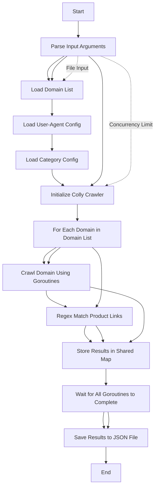

## Groblin
> A smart, scalable Go crawler for e-comm

## Features
- Multi file suppport
- Concurrent Crawling
- Smart URL Discovery
- Color logs
- Fast
- Caching
- Scalable
- Performance Optimized

## Workflow


<!---  --->

---

## Requirements

- Go (version 1.22 or higher)
- [Colly](https://github.com/gocolly/colly)
- [Charmbracelet/log](https://github.com/charmbracelet/log) 
- Configuration files:
  - `config/user_agent.json` - Contains a list of User-Agents.
  - `config/category.json` - Contains the categories for filtering product links.

## Installation

1. Clone the repository:
   ```bash
   git clone https://github.com/r3yc0n1c/groblin.git
   cd groblin
   ```
2. Install dependencies:
  ```bash
  go mod tidy
  ```
3. Build
  ```bash
  make build
  ```

## Usage

Command-Line Arguments:
- `--file`: Path to the input file containing the list of domains (CSV/JSON).
- `--n`: Number of domains to explore concurrently (default: 1).

### Start Crawling

```bash
bin/groblin --file ./dom.json --n 4
```

### Output
```json
{
  "example.com": [
    "https://example.com/items/1",
    "https://example.com/items/2"
  ],
  "anotherexample.com": [
    "https://anotherexample.com/products/1"
  ]
}
```
